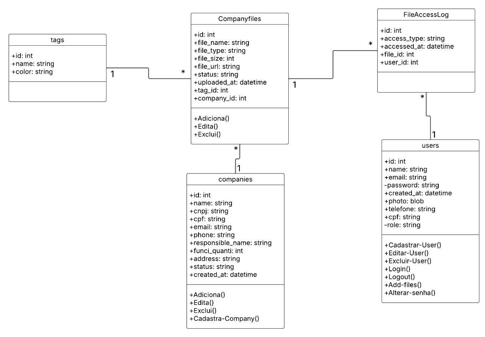

# MEF Angular

Este projeto é a interface web do sistema **MEF**, desenvolvido em Angular 19.2.5, com foco em gestão de usuários, empresas e arquivos. A aplicação utiliza um conjunto moderno de bibliotecas para fornecer uma experiência fluida, responsiva e funcional.

## ✅ Versões e Tecnologias

- **Angular**: 19.2.5  
- **Node**: 20+ recomendado  
- **Angular Material**: UI moderna com componentes prontos  
- **NGX-Mask**: Máscaras de entrada (CPF, CNPJ, telefone etc.)  
- **TypeScript**: tipagem segura  
- **HTML/CSS**: estilização customizada com tema escuro  

## 🚀 Funcionalidades Principais

- Cadastro e login de usuários
- Edição de perfil com foto
- Máscaras de CPF/CNPJ/telefone
- Cadastro e visualização de empresas
- Upload e gerenciamento de arquivos (por empresa)
- Modal de confirmação visual
- Integração com `localStorage` para persistência de dados
- Interface responsiva com Angular Material

## 📦 Instalação das Dependências

Após clonar o repositório, execute:

```bash
npm install
```

▶️ Executar o projeto localmente
```bash
ng serve
```


Depois, acesse em: http://localhost:4200
-

# 📚 Bibliotecas Instaladas
🔹 Angular Material

Instalação:
```bash
ng add @angular/material
```

Componentes utilizados:
- MatInputModule

- MatButtonModule
- MatIconModule
- MatDialogModule
- MatSnackBarModule
- MatTableModule
- MatTooltipModule
- MatSelectModule

 

# 🔹 NGX-Mask
Instalação:

```bash
npm install ngx-mask
```
### Importação e configuração:
```bash
import { NgxMaskDirective, provideNgxMask } from 'ngx-mask';

@NgModule({
  imports: [NgxMaskDirective],
  providers: [provideNgxMask()]
})

```
# 

### Para o seu primeiro acesso ao sistema, ele conta com um usuario admin padrão

Email: admin@admin.com

senha: admin

For more information on using the Angular CLI, including detailed command references, visit the [Angular CLI Overview and Command Reference](https://angular.dev/tools/cli) page.

## MER


# 👥 Equipe
Este projeto foi desenvolvido para fins educacionais e internos. Sinta-se à vontade para adaptar e expandir conforme necessário.
